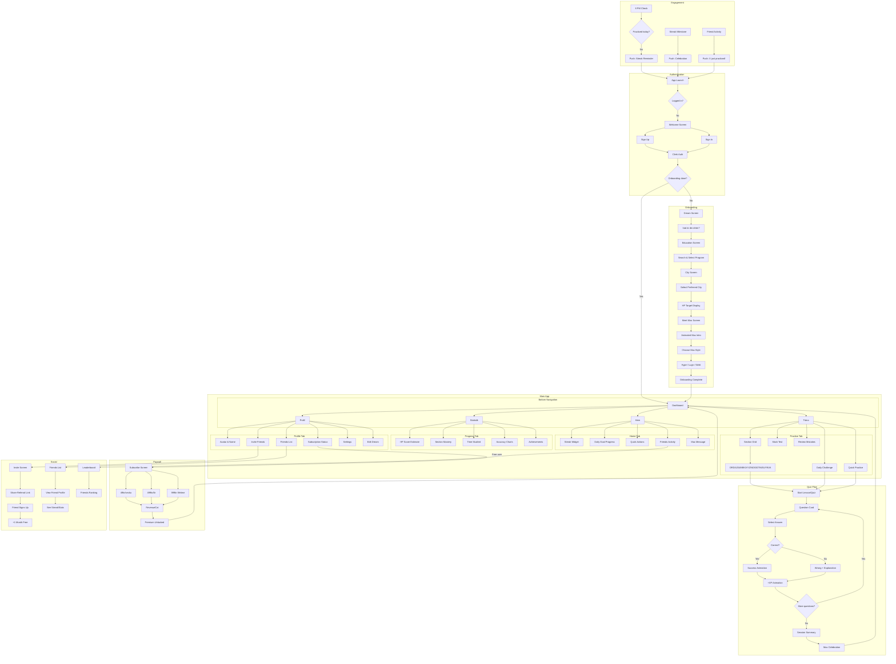

# Maxa Product Roadmap

## Vision
Maxa är Duolingo för Högskoleprovet - den snabbaste, roligaste vägen att nå ditt drömresultat.

## Target User
- Swedish students (16-25) preparing for Högskoleprovet
- Goal: Get into competitive university programs
- Motivation: Dream education in dream city

---

## Development Approach

**UI-First Strategy:**
1. Build all screens with mock data
2. Perfect the user experience and animations
3. Connect backend services once UI is solid

This allows faster iteration on UX without backend dependencies.

---

## User Flow Diagram

---

## Execution Phases

### Phase 1: UI Foundation
**Focus:** Build all screens with mock data, NativeWind styling

| Task | Description |
|------|-------------|
| NativeWind setup | Configure Tailwind for React Native |
| Base UI components | Button, Card, Input, ProgressBar, etc. |
| Auth screens (UI only) | Welcome, Sign In, Sign Up |
| Onboarding screens | Dream, Education, City, Meet Max, Choose Style |
| Tab navigation | Set up 4-tab layout |
| Dashboard UI | Streak widget, goal tracker, quick actions |
| Practice UI | Section grid, quiz flow screens |
| Progress UI | Stats, charts, achievements |
| Profile UI | Settings, invite, friends |

### Phase 2: Animations & Polish
**Focus:** Make it feel premium and fast

| Task | Description |
|------|-------------|
| Micro-interactions | Button presses, card transitions |
| Quiz feedback | Correct/wrong animations |
| XP animations | Flying numbers, level-up celebration |
| Max animations | Avatar expressions, celebration |
| Loading states | Skeletons, shimmer effects |
| Haptic feedback | Success/error vibrations |

### Phase 3: Backend Integration
**Focus:** Connect UI to real data

| Task | Description |
|------|-------------|
| Convex setup | Initialize, deploy schema |
| Clerk auth | Google, Apple, Email/Password |
| User flow | Real auth → onboarding → app |
| Data persistence | Questions, sessions, progress |
| Real-time updates | Streaks, leaderboard |

### Phase 4: AI & Engagement
**Focus:** Max coach and retention features

| Task | Description |
|------|-------------|
| Vercel AI SDK | Set up Gemini gateway |
| Max responses | Personality-based prompts |
| Push notifications | Expo Notifications setup |
| Daily challenges | Server-generated goals |

### Phase 5: Monetization
**Focus:** Revenue

| Task | Description |
|------|-------------|
| RevenueCat setup | Products, entitlements |
| Paywall screen | Connect to purchases |
| Referral system | Deep links, rewards |
| PostHog analytics | Funnel tracking |

---

## Screen Inventory

### Auth Flow (3 screens)
| Screen | File | Key Components |
|--------|------|----------------|
| Welcome | `(auth)/welcome.tsx` | Hero, value prop, CTAs |
| Sign In | `(auth)/sign-in.tsx` | Google/Apple/Email buttons |
| Sign Up | `(auth)/sign-up.tsx` | Same + terms, referral input |

### Onboarding (5 screens)
| Screen | File | Key Components |
|--------|------|----------------|
| Dream | `(onboarding)/dream.tsx` | Text input, suggestions |
| Education | `(onboarding)/education.tsx` | Search, autocomplete |
| City | `(onboarding)/city.tsx` | City picker |
| Meet Max | `(onboarding)/meet-max.tsx` | Animated intro |
| Choose Style | `(onboarding)/choose-max-style.tsx` | 3 style cards |

### Main App (4 tabs + 5 screens)
| Screen | File | Key Components |
|--------|------|----------------|
| Dashboard | `(app)/(tabs)/index.tsx` | Streak, goals, actions |
| Practice | `(app)/(tabs)/practice.tsx` | Section grid, challenges |
| Progress | `(app)/(tabs)/progress.tsx` | Stats, charts, badges |
| Profile | `(app)/(tabs)/profile.tsx` | Avatar, settings, invite |
| Lesson | `(app)/lesson/[id].tsx` | Content, exercises |
| Quiz | `(app)/quiz/[id].tsx` | Questions, timer |
| Review | `(app)/review.tsx` | Wrong answers |
| Leaderboard | `(app)/leaderboard.tsx` | Friends ranking |
| Invite | `(app)/invite.tsx` | Share, track |

### Paywall (1 screen)
| Screen | File | Key Components |
|--------|------|----------------|
| Subscribe | `(paywall)/subscribe.tsx` | Plans, features, CTA |

**Total: 18 screens**

---

## Gamification System

### Streaks
| Milestone | Reward |
|-----------|--------|
| 7 days | Bronze flame badge |
| 30 days | Silver flame badge |
| 100 days | Gold flame badge |
| 365 days | Diamond flame badge |

### XP System
| Action | Base XP | Bonus |
|--------|---------|-------|
| Correct answer | 10 | +5 (fast), +10 (streak) |
| Complete lesson | 50 | - |
| Daily challenge | 100 | - |
| Invite friend | 200 | - |

### Levels
- 100 levels total
- Exponential XP curve
- Level-up triggers Max celebration

---

## Max AI Coach

### Personalities (3 styles)

| Style | Swedish | Tone | Example Message |
|-------|---------|------|-----------------|
| Hype | Hype | Energetic, excited | "YEEEES! Du körde helt sjukt bra! Ingen kan stoppa dig nu!" |
| Calm | Lugn | Supportive, gentle | "Bra jobbat. Du gör framsteg varje dag. Fortsätt i din egen takt." |
| Strict | Strikt | Tough love, direct | "Okej resultat. Men du kan bättre. Kör en runda till." |

### Trigger Events
- Streak milestone reached
- Wrong answer (offer explanation)
- Level up
- Inactivity (24h+)
- Daily challenge completed

### Rate Limits
- Free tier: 10 AI messages/day
- Premium: Unlimited

---

## Pricing

| Plan | Price | Billing | Features |
|------|-------|---------|----------|
| Free | 0 kr | - | 5 questions/day, basic stats |
| Weekly | 49 kr | Weekly | Unlimited, all sections, no ads |
| Yearly | 499 kr | Yearly | Same as weekly, best value |
| Lifetime | 999 kr | One-time | Forever access |

### Referral Rewards
- Referrer: +1 free month per converted friend
- Referred: +7 days extended trial

---

## Success Metrics

### North Star
**Weekly Active Users (WAU)** practicing 3+ days

### Key Metrics
| Metric | Target |
|--------|--------|
| D1 Retention | >40% |
| D7 Retention | >25% |
| D30 Retention | >15% |
| Free → Paid | >5% |
| Referral rate | >10% |
| Avg. streak | >7 days |

---

## HP Sections Reference

| Code | Name | Type |
|------|------|------|
| ORD | Ordförståelse | Verbal |
| LÄS | Läsförståelse | Verbal |
| MEK | Meningskomplettering | Verbal |
| ELF | Engelsk läsförståelse | Verbal |
| XYZ | Matematisk problemlösning | Kvantitativ |
| KVA | Kvantitativa jämförelser | Kvantitativ |
| NOG | Kvantitativa resonemang | Kvantitativ |
| DTK | Diagram, tabeller, kartor | Kvantitativ |
