# Maxa Product Roadmap

## Vision
Maxa är Duolingo för Högskoleprovet - den snabbaste, roligaste vägen att nå ditt drömresultat.

## Target User
- Swedish students (16-25) preparing for Högskoleprovet
- Goal: Get into competitive university programs
- Motivation: Dream education in dream city

---

## Development Approach

**UI-First Strategy:**
1. Build all screens with mock data
2. Perfect the user experience and animations
3. Connect backend services once UI is solid

This allows faster iteration on UX without backend dependencies.

---

## User Flow Overview

**Activation:** Set exam date + goal score → complete baseline → finish first mission → create account.

---

### Authentication Flow

Account creation delayed until after first mission (reduces friction).

---

### Onboarding Flow

Goal: Get to activation fast. No fluff.

```mermaid
flowchart TD
    A["1. Welcome & Avatar"] --> B["Name (optional) + Persona"]
    B --> C["2. Dream Outcome"]
    C --> D["Program search + City"]
    D --> E["3. Required Score"]
    E --> F["Slider: Målscore → program"]
    F --> G["4. Test Date"]
    G --> H["'87 dagar kvar till HP'"]
    H --> I["5. Time Commitment"]
    I --> J["10 / 15 / 25 min per dag"]
    J --> K["6. Your Plan"]
    K --> L["'Starta baseline-testet'"]
    L --> M["7. Baseline Test"]
    M --> N["10-20 mixed questions"]
    N --> O["8. Results & First Mission"]
    O --> P["Show level + gap + weakest"]
    P --> Q["'Kör dagens pass nu'"]
    Q --> R["First mission complete"]
    R --> S["9. Account Creation"]
    S --> T["Apple / Google / Email"]
    T --> U[Dashboard]
```

**Removed from onboarding:**
- Meet Max / Choose coach style → moved to Jag tab
- Paywall → triggers on daily limit, not during onboarding

---

### Main App Navigation (3 Tabs)

```mermaid
flowchart LR
    T[App] --> U["📅 Idag"]
    T --> V["📚 Träna"]
    T --> W["👤 Jag"]
```

#### Idag Tab (Home)

Drives daily usage and triggers paywall.

```mermaid
flowchart TD
    U["📅 Idag"] --> U1["Countdown: X dagar kvar till HP"]
    U --> U2["Goal: Målscore → program, stad"]
    U --> U3["Dagens mål: 40 frågor"]
    U --> U4["Starta dagens pass"]
    U --> U5["Streak + XP chip"]
    U3 --> U6{Limit reached?}
    U6 -->|Yes| U7[Paywall inline]
```

#### Träna Tab (Power Users)

Manual control for engaged users.

```mermaid
flowchart TD
    V["📚 Träna"] --> V1["Svagaste först (default)"]
    V --> V2["Delprov-träning"]
    V --> V3["Simulera prov (Pro)"]
    V1 --> Q[Quiz Flow]
    V2 --> Q
    V3 --> Q
```

#### Jag Tab (Progress + Coach)

Progress tracking and AI coach combined.

```mermaid
flowchart TD
    W["👤 Jag"] --> W1["Progress Card"]
    W --> W2["Weakness List"]
    W --> W3["AI Coach Box"]
    W1 --> W1a["Predicted HP vs Goal"]
    W1 --> W1b["Chans till programlista"]
    W2 --> W2a["Concept tiles (röd/gul/grön)"]
    W3 --> W3a["Fråga din HP-coach..."]
    W3 --> W3b["Quick actions"]
```

---

### Quiz Flow

---

### Paywall Flow (Inline on Idag Tab)

Shown when daily limit reached. One core offer, then downsell.

```mermaid
flowchart TD
    A[Daily limit reached] --> B["Inline on Idag tab"]
    B --> C["Maxa HP Pro – 99 kr/mån"]
    B --> D["Founders Lifetime – 899 kr"]
    C --> E[RevenueCat]
    D --> E
    E --> F[Premium Unlocked]
    F --> G[Continue training]
```

---

### Social Flow (Post-v1)

Cut for v1 to focus on activation. Add once churn data shows where unlockables help.

---

### Notifications Flow

---

## Execution Phases

### Phase 1: UI Foundation
**Focus:** Build all screens with mock data, NativeWind styling

| Task | Description |
|------|-------------|
| NativeWind setup | Configure Tailwind for React Native |
| Base UI components | Button, Card, Input, ProgressBar, etc. |
| Auth screens (UI only) | Welcome, Sign In, Sign Up |
| Onboarding screens | Dream, Education, City, Meet Max, Choose Style |
| Tab navigation | Set up 4-tab layout |
| Dashboard UI | Streak widget, goal tracker, quick actions |
| Practice UI | Section grid, quiz flow screens |
| Progress UI | Stats, charts, achievements |
| Profile UI | Settings, invite, friends |

### Phase 2: Animations & Polish
**Focus:** Make it feel premium and fast

| Task | Description |
|------|-------------|
| Micro-interactions | Button presses, card transitions |
| Quiz feedback | Correct/wrong animations |
| XP animations | Flying numbers, level-up celebration |
| Max animations | Avatar expressions, celebration |
| Loading states | Skeletons, shimmer effects |
| Haptic feedback | Success/error vibrations |

### Phase 3: Backend Integration
**Focus:** Connect UI to real data

| Task | Description |
|------|-------------|
| Convex setup | Initialize, deploy schema |
| Clerk auth | Google, Apple, Email/Password |
| User flow | Real auth → onboarding → app |
| Data persistence | Questions, sessions, progress |
| Real-time updates | Streaks, leaderboard |

### Phase 4: AI & Engagement
**Focus:** Max coach and retention features

| Task | Description |
|------|-------------|
| Vercel AI SDK | Set up Gemini gateway |
| Max responses | Personality-based prompts |
| Push notifications | Expo Notifications setup |
| Daily challenges | Server-generated goals |

### Phase 5: Monetization
**Focus:** Revenue

| Task | Description |
|------|-------------|
| RevenueCat setup | Products, entitlements |
| Paywall screen | Connect to purchases |
| Referral system | Deep links, rewards |
| PostHog analytics | Funnel tracking |

---

## Screen Inventory

### Auth Flow (1 screen)
| Screen | File | Key Components |
|--------|------|----------------|
| Sign In | `(auth)/sign-in.tsx` | Apple/Google/Email (returning users) |

### Onboarding (8 screens)
| Screen | File | Key Components |
|--------|------|----------------|
| Welcome | `(onboarding)/welcome.tsx` | Name, persona picker |
| Dream | `(onboarding)/dream.tsx` | Program search, city picker |
| Score | `(onboarding)/score.tsx` | Target HP slider |
| Date | `(onboarding)/date.tsx` | Exam date, countdown |
| Time | `(onboarding)/time.tsx` | Daily commitment (10/15/25 min) |
| Plan | `(onboarding)/plan.tsx` | Your path summary, baseline CTA |
| Baseline | `(onboarding)/baseline.tsx` | 10-20 question test |
| Results | `(onboarding)/results.tsx` | Level, gap, first mission CTA |

### Main App (3 tabs + 2 screens)
| Screen | File | Key Components |
|--------|------|----------------|
| Idag | `(app)/(tabs)/index.tsx` | Countdown, goal, daily mission, streak |
| Träna | `(app)/(tabs)/trana.tsx` | Svagaste först, delprov, simulera |
| Jag | `(app)/(tabs)/jag.tsx` | Progress, weaknesses, AI coach |
| Quiz | `(app)/quiz/[id].tsx` | Questions, timer, feedback |
| Review | `(app)/review.tsx` | Wrong answers explanation |

**Total: 14 screens**

---

## Gamification System

### Streaks
| Milestone | Reward |
|-----------|--------|
| 7 days | Bronze flame badge |
| 30 days | Silver flame badge |
| 100 days | Gold flame badge |
| 365 days | Diamond flame badge |

### XP System
| Action | Base XP | Bonus |
|--------|---------|-------|
| Correct answer | 10 | +5 (fast), +10 (streak) |
| Complete lesson | 50 | - |
| Daily challenge | 100 | - |
| Invite friend | 200 | - |

### Levels
- 100 levels total
- Exponential XP curve
- Level-up triggers Max celebration

---

## Max AI Coach

### Personalities (3 styles)

| Style | Swedish | Tone | Example Message |
|-------|---------|------|-----------------|
| Hype | Hype | Energetic, excited | "YEEEES! Du körde helt sjukt bra! Ingen kan stoppa dig nu!" |
| Calm | Lugn | Supportive, gentle | "Bra jobbat. Du gör framsteg varje dag. Fortsätt i din egen takt." |
| Strict | Strikt | Tough love, direct | "Okej resultat. Men du kan bättre. Kör en runda till." |

### Trigger Events
- Streak milestone reached
- Wrong answer (offer explanation)
- Level up
- Inactivity (24h+)
- Daily challenge completed

### Rate Limits
- Free tier: 10 AI messages/day
- Premium: Unlimited

---

## Pricing

| Plan | Price | Features |
|------|-------|----------|
| Free | 0 kr | ~30 questions/day, 3 AI asks/day |
| Pro | 99 kr/mån | Unlimited questions, unlimited AI coach, full HP sim |
| Founders Lifetime | 899 kr | Forever access (limited offer) |

---

## Success Metrics

### North Star
**Weekly Active Users (WAU)** practicing 3+ days

### Key Metrics
| Metric | Target |
|--------|--------|
| D1 Retention | >40% |
| D7 Retention | >25% |
| D30 Retention | >15% |
| Free → Paid | >5% |
| Referral rate | >10% |
| Avg. streak | >7 days |

---

## HP Sections Reference

| Code | Name | Type |
|------|------|------|
| ORD | Ordförståelse | Verbal |
| LÄS | Läsförståelse | Verbal |
| MEK | Meningskomplettering | Verbal |
| ELF | Engelsk läsförståelse | Verbal |
| XYZ | Matematisk problemlösning | Kvantitativ |
| KVA | Kvantitativa jämförelser | Kvantitativ |
| NOG | Kvantitativa resonemang | Kvantitativ |
| DTK | Diagram, tabeller, kartor | Kvantitativ |
